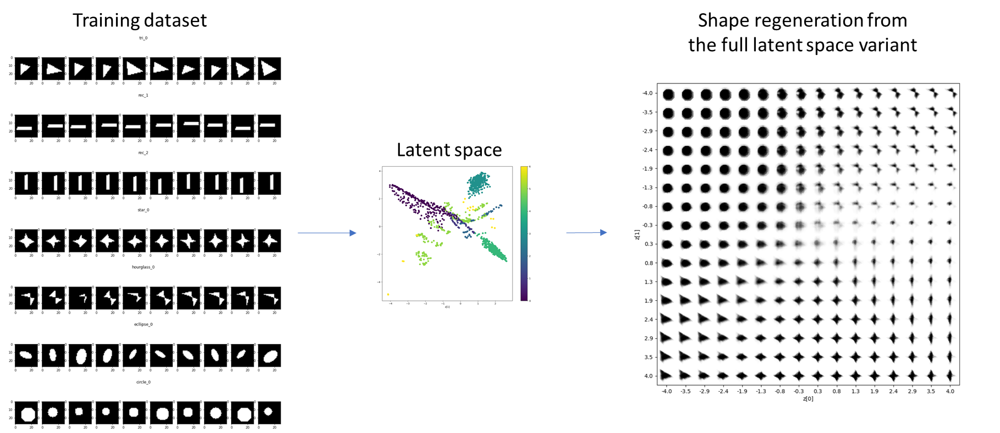
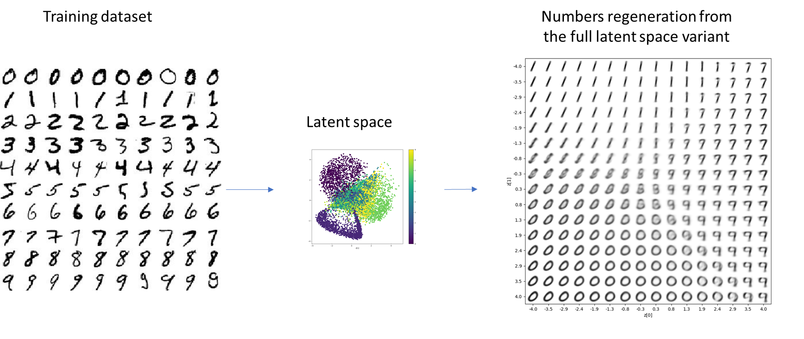

# VAE_shape_variation

## Use
run src/run_tf_vae.py (change parameters in config)

##  Data
1. mnist: download the official dataset
2. random shapes: generated using python skimage.draw
   (please see data/generate_random_shape.ipynb) 
   
## VAE
src/tf_vae.py (fc or cnn-based)

## Results
1. random shapes

   
2. mnist
